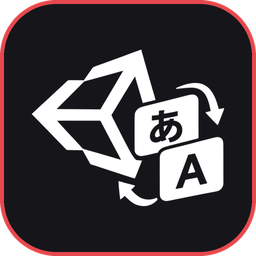

<p align="center">
  
</p>

<h1 align="center">Unity Game Language Changer</h1>

<p align="center">Переводит любую игру на Unity на твой язык в пару кликов.</p>

Программа ставит в игру [BepInEx](https://github.com/BepInEx/BepInEx) и [XUnity.AutoTranslator](https://github.com/bbepis/XUnity.AutoTranslator) и настраивает их под выбранный язык. Весь текст игры переводится на лету, готовый перевод сохраняется и в следующий раз появляется сразу.

### Как пользоваться

1. Скачай `UnityGameLanguageChanger-x.x.x.exe` из [Releases](../../releases) и запусти — установка не нужна.
2. Вставь путь до папки игры (или перетащи папку/exe в окно).
3. Выбери язык справа сверху.
4. Нажми **Установить перевод**, потом **Запустить игру**.

Первый запуск IL2CPP-игры занимает 1–3 минуты — BepInEx один раз разбирает игру. Дальше игра запускается как обычно.

### Что умеет

- Сама определяет, как собрана игра: **Mono** или **IL2CPP**, **x64** или **x86**, версию Unity и язык оригинала.
- Ставит подходящую сборку: BepInEx 5 для Mono, BepInEx 6 для IL2CPP.
- Находит античиты (EasyAntiCheat, BattlEye, ACE, XIGNCODE, GameGuard и другие) и не даёт поставить мод, чтобы тебя не забанили.
- 104 языка, переводчики: Google, Bing, DeepL, Papago, Yandex, Baidu.
- **Перевод заранее**: вытаскивает текст из файлов игры (assets, бандлы, код, кэш загрузок) и переводит его пачками до запуска — в игре русский появляется мгновенно.
- Сам находит игры на Unity в библиотеках Steam, Epic, GOG и itch.
- Показывает, как идёт первый запуск, и загрузился ли перевод.
- Предлагает ярлык на рабочем столе для переведённой игры.
- Редактор перевода: можно поправить любую строку руками. Экспорт и импорт перевода в zip, чтобы поделиться с друзьями.
- Интерфейс на русском, украинском и английском — по языку Windows. Цвет акцента и прозрачность окна.
- Для языков не на латинице (русский, японский, китайский и т.д.) подкачивает шрифт с нужными буквами для TextMeshPro.
- Включает, выключает и полностью удаляет перевод одной кнопкой. Готовый перевод можно сохранить при удалении.
- Если в игре уже есть BepInEx с модами, ставит перевод рядом, ничего не ломая.

### Ограничения

- Только Windows и игры на Unity.
- Онлайн-игры могут запрещать моды даже без античита — решай сам.
- Перевод машинный. Готовые строки лежат в `BepInEx/Translation/<язык>/Text` — их можно поправить руками.

## Сборка из исходников

```bash
npm install
npm start
```

Готовый exe:

```bash
npm run dist
```

Файл появится в папке `release/`.
